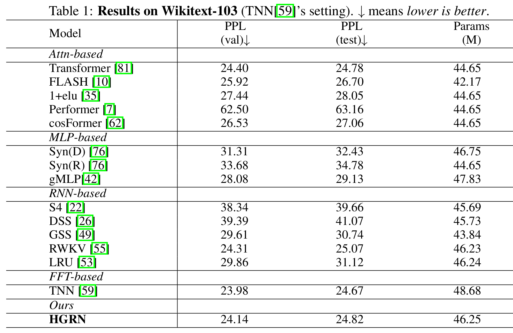

# NLP Transformer
PyTorch implementation of nlp transformer that incorporates RoPE positional embedding, RMSNorm, and SwiGLU.

## Result
The code was tested on the wikitext-103 dataset with the same setting as in HGRN's paper.

My implementation's result:
| valid ppl      | test ppl |
| ----------- | ----------- |
| 22.13      | 22.62       |

The result is over 2 ppl lower than their implementation, which provides a strong baseline for future experiments.
